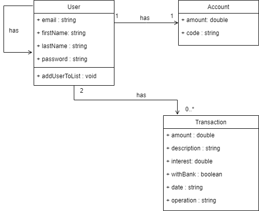

# Pay My Buddy

## Description

Ce projet est une application de transfert d'argent permettant aux utilisateurs d'échanger de l'argent entre eux. Les utilisateurs peuvent déposer ou retirer de l'argent auprès de la banque et transférer de l'argent à d'autres utilisateurs s'ils sont dans leur liste d'amis.

## Prérequis

Avant de commencer, assurez-vous d'avoir les éléments suivants installés sur votre machine :

- Java 11 ou supérieur
- Docker
- Docker Compose
- Node.js et npm

## Installation

### Étape 1 : Configuration de la base de données

1. Clonez le repository du projet sur votre machine locale :

   ```bash
   git clone https://github.com/Isilud/pay_my_buddy.git
   cd pay_my_buddy
   ```

2. Créez un fichier .env dans le dossier /application et ajoutez-y les informations suivantes :

   ```bash
   MYSQL_DATABASE=votre_nom_de_base_de_donnees
   MYSQL_ROOT_PASSWORD=votre_mot_de_passe_root
   ```

3. Lancez Docker Compose pour démarrer la base de données MySQL :

   ```bash
   cd application/docker
   docker-compose up -d
   ```

### Étape 2 : Lancement du backend

1. Assurez-vous d'avoir configuré correctement votre base de données comme décrit ci-dessus.

2. Retournez au répertoire principal du projet et lancez l'application Spring :

   ```bash
   cd ../..
   mvn spring-boot:run
   ```

### Étape 3 : Lancement du frontend

1. Accédez au répertoire du site et installez les dépendances :

   ```bash
   cd site
   npm install
   ```

2. Démarrez l'application front-end :

   ```bash
   npm run dev
   ```

## Diagrammes

### Diagramme UML



### Schéma de la Base de Données


